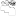

<!--
*** Thanks for checking out the Best-README-Template. If you have a suggestion
*** that would make this better, please fork the repo and create a pull request
*** or simply open an issue with the tag "enhancement".

\*\*\* Thanks again! Now go create something AMAZING! :D
-->

<!-- PROJECT SHIELDS -->
<!--
*** I'm using markdown "reference style" links for readability.
*** Reference links are enclosed in brackets [ ] instead of parentheses ( ).
*** See the bottom of this document for the declaration of the reference variables
*** for contributors-url, forks-url, etc. This is an optional, concise syntax you may use.
*** https://www.markdownguide.org/basic-syntax/#reference-style-links
-->

[![Contributors][contributors-shield]][contributors-url]
[![Forks][forks-shield]][forks-url]
[![Stargazers][stars-shield]][stars-url]
[![Issues][issues-shield]][issues-url]
[![MIT License][license-shield]][license-url]
[![LinkedIn][linkedin-shield]][linkedin-url]

<!-- PROJECT LOGO -->
 

  

<h3 align="center">memespace</h3>

  

    a place for degenerates
     
    <a href="https://github.com/palmerusaf/memespace"><strong>Explore the docs »</strong></a>
     
     
    <a href="https://palmerusaf.github.io/memespace">View Demo</a>
    ·
    <a href="https://github.com/palmerusaf/memespace/issues">Report Bug</a>
    ·
    <a href="https://github.com/palmerusaf/memespace/issues">Request Feature</a>
  

<!-- TABLE OF CONTENTS -->

  
Table of Contents

  <ol>
    <li>
      <a href="#about-the-project">About The Project</a>
      <ul>
        <li><a href="#built-with">Built With</a></li>
        <li><a href="#purpose">Purpose</a></li>
      </ul>
    </li>
    <li><a href="#roadmap">Roadmap</a></li>
    <li><a href="#project-conventions">Project Conventions</a></li>
    <li><a href="#contributing">Contributing</a></li>
    <li><a href="#license">License</a></li>
    <li><a href="#contact">Contact</a></li>
    <li><a href="#acknowledgments">Acknowledgments</a></li>
  </ol>

<!-- ABOUT THE PROJECT -->

## About The Project

[![Product Name Screen Shot][product-screenshot]](https://palmerusaf.github.io/memespace)

A social media app exclusively for memes.

(<a href="#top">back to top</a>)

### Built With

- [![jest]](https://jestjs.io/)
- [![nextjs]](https://nextjs.org/)
- [![react]](https://reactjs.org/)
- [![firebase]](https://firebase.google.com/)
- [![storybook]](https://storybook.js.org/)
- [![typescript]](https://www.typescriptlang.org/)
- [![tailwindcss]](https://tailwindcss.com/)

(<a href="#top">back to top</a>)

### Purpose

The purpose of this project is to serve as a capstone project to show off everything I've learned in front-end development.

<!-- ROADMAP -->

## Roadmap

- [x] Add meme creator
- [ ] Add user login
- [ ] Add friends list
- [ ] Add comment system
- [ ] Add wall
- [ ] Add upvote system
- [ ] Add weekly meme challenges
- [ ] Add notification system

See the [open issues](https://github.com/palmerusaf/memespace/issues) for a full list of proposed features (and known issues).

(<a href="#top">back to top</a>)

## Project Conventions

See convention link [here](https://github.com/palmerusaf/memespace/blob/master/CONVENTIONS.md) for a list of all the projects file/coding conventions.

(<a href="#top">back to top</a>)

<!-- CONTRIBUTING -->

## Contributing

If you have a suggestion that would make this better, please fork the repo and create a pull request. You can also simply open an issue with the tag "enhancement".
Don't forget to give the project a star! Thanks again!

1. Fork the Project
2. Create your Feature Branch (`git checkout -b feature/AmazingFeature`)
3. Commit your Changes (`git commit -m 'Add some AmazingFeature'`)
4. Push to the Branch (`git push origin feature/AmazingFeature`)
5. Open a Pull Request

(<a href="#top">back to top</a>)

<!-- LICENSE -->

## Licenses

- Distributed under the MIT License. See `LICENSE` for more information.

(<a href="#top">back to top</a>)

<!-- CONTACT -->

## Contact

Branden Palmer - [@branden_palmer8](https://twitter.com/branden_palmer8) - brandenpalmer08@gmail.com

Project Link: [https://github.com/palmerusaf/memespace](https://github.com/palmerusaf/memespace)

(<a href="#top">back to top</a>)

<!-- ACKNOWLEDGMENTS -->

## Acknowledgments

- [The Odin Project](https://www.theodinproject.com/)
- [APIMeme Generator](https://apimeme.com)
- [Best-README-Template](https://github.com/othneildrew/Best-README-Template)

(<a href="#top">back to top</a>)

<!-- MARKDOWN LINKS & IMAGES -->
<!-- https://www.markdownguide.org/basic-syntax/#reference-style-links -->

[contributors-shield]: https://img.shields.io/github/contributors/palmerusaf/memespace.svg?style=for-the-badge
[contributors-url]: https://github.com/palmerusaf/memespace/graphs/contributors
[forks-shield]: https://img.shields.io/github/forks/palmerusaf/memespace.svg?style=for-the-badge
[forks-url]: https://github.com/palmerusaf/memespace/network/members
[stars-shield]: https://img.shields.io/github/stars/palmerusaf/memespace.svg?style=for-the-badge
[stars-url]: https://github.com/palmerusaf/memespace/stargazers
[issues-shield]: https://img.shields.io/github/issues/palmerusaf/memespace.svg?style=for-the-badge
[issues-url]: https://github.com/palmerusaf/memespace/issues
[license-shield]: https://img.shields.io/github/license/palmerusaf/memespace.svg?style=for-the-badge
[license-url]: https://github.com/palmerusaf/memespace/blob/master/LICENSE
[linkedin-shield]: https://img.shields.io/badge/-LinkedIn-black.svg?style=for-the-badge&logo=linkedin&colorB=555
[linkedin-url]: https://linkedin.com/in/branden-palmer-968765120
[product-screenshot]: ./screen-shot.png

<!-- Badges -->

[tailwindcss]: https://img.shields.io/badge/tailwindcss-%2338B2AC.svg?style=for-the-badge&logo=tailwind-css&logoColor=white
[react]: https://img.shields.io/badge/react-%2320232a.svg?style=for-the-badge&logo=react&logoColor=%2361DAFB
[jest]: https://img.shields.io/badge/-jest-%23C21325?style=for-the-badge&logo=jest&logoColor=white
[typescript]: https://img.shields.io/badge/typescript-%23007ACC.svg?style=for-the-badge&logo=typescript&logoColor=white
[storybook]: https://img.shields.io/badge/-Storybook-FF4785?style=for-the-badge&logo=storybook&logoColor=white
[nextjs]: https://img.shields.io/badge/Next-black?style=for-the-badge&logo=next.js&logoColor=white
[firebase]: https://img.shields.io/badge/firebase-%23039BE5.svg?style=for-the-badge&logo=firebase